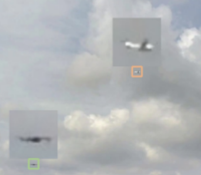
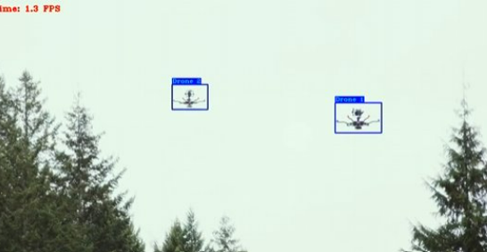
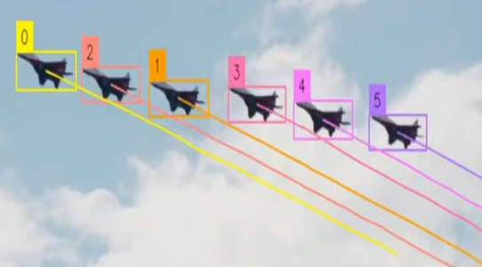

# UAV Detection, Tracking, and Classification Using Computer Vision
## Overview
This project aims to develop an advanced system for detecting, tracking, and classifying unmanned aerial vehicles (UAVs) using computer vision as an alternative to radar-based methods. Traditional radar systems face limitations in complex 3D environments and often require multiple types of radars (e.g., pulse radars for surveillance and continuous-wave radars for tracking) to achieve full-area coverage. These systems can be costly and cumbersome. Our approach seeks to replace these multiple radar systems with a camera-based solution, reducing complexity while enhancing detection accuracy and improving user experience. 

## Technical approach
Yolov8 for Detection: Utilized YOLOv8 object detection
model trained on drone imagery to identify UAVs in real time
with bounding boxes. ​

MiDaS for Depth Estimation: Used the MiDaS model to
estimate relative depth in each video frame. This helps
distinguish drones at different distances from the camera.​

SORT for Tracking: Employed the SORT algorithm with
Kalman filtering to track UAVs across frames. Able to predict
motion over time on the 2d plane.

## Challenges
Difficulty obtaining high-quality, varied training data for drone
detection, especially at different depths and orientations.​

Poor tracking performance when drones changed depth relative
to the camera due to:​

The limitations of using a 2D Kalman filter that doesn't
account for depth (z-axis) motion.​

Inaccurate depth estimates from the MiDaS model,
which lacks temporal consistency and absolute scale.​

Depth-based speed estimation was imprecise and hard to
validate without ground truth, owing to relative (not absolute)
depth maps.

